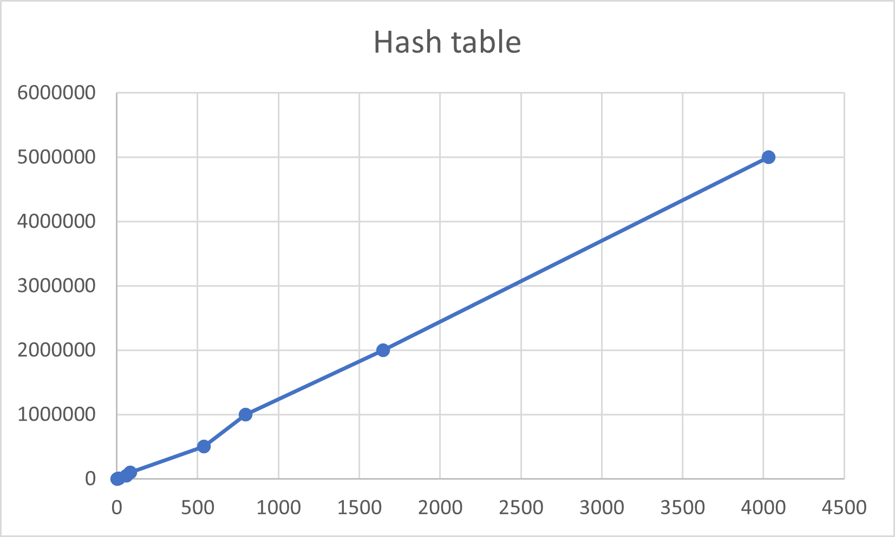

# Kurssitehtävien oppima ja raportit

Kirjoita jokaisesta alla olevasta kurssitehtävästä parilla lauseella miten tehtävän tekeminen sujui ja mitä siitä opit.

Jos tehtävässä pyydetään **raportoimaan** jotain, kirjoita myös nämä raportit tähän dokumenttiin.

## 00-init

## 01-arrays

## 02-mode


Arvoja taulukoimalla arvioidaan, että funktion aikakompleksisuusluokka on todennäköisesti ``O(n) - O(n^2)`` .

Koodia tutkailemalla kuitenkin nähdään, että aikakompleksisuusluokka on todennäköisesti huonompi, mitä taulukosta
voidaan lukea.
Funktio järjestää aluksi listan insertion sortilla, jonka aikakompleksisuus on parhaassa tapauksessa ``O(n)`` ja
huonoimmassa tapauksessa ``O(n^2)``.
Funktio käy sitten läpi listan ja laskee tyyppiarvon,johon menee aina ``O(n)`` aikaa. Tällöin koko
funktion aikakompleksisuusluokka huonoimmassa tapauksessa on ``O(n^2)``.

Taulukoiduissa arvoissa oli jonkin verran vaihtelua, joten niistä ei suoraan pystynyt päättelemään funktion
aikakompleksisuutta.
Funktion nopeuteen voi esimerkiksi vaikuttaa käytetty suoritusalusta.

## 03-draw

## 04-1-stack

## 04-2-queue

## 04-3-linkedlist

## 05-binsearch

## 05-invoices

## 67-phonebook

Alla olevissa kuvissa vertailua suoritusajan suhteesta tietosäiliön elementtien määrään. Näyttää lineaariselta.



Hajautusfunktiona kokeilin tehtävässä jos jonkinlaisia yhdistelmiä summa- ja kertolaskuja, sisältäen tietysti
alkulukuja.
Koska olen käyttänyt hajautusfunktioita jo aiemmin koodatessani, päädyin suht nopeasti yleisesti hyväksi todettuun
djb2 -funktioon, jonka pitäisi hajauttaa arvoja suhteellisen tasaisesti.

Hajautustauluthan tunnetaan siitä, että mitä enemmän tyhjää tilaa niille antaa, sen nopeammin ne toimivat. Tämä toki
näkyy
lisääntyneenä muistinkulutuksena. Tämä näkyy myös reallokoinnissa: mitä enemmän ekstratilaa reallokoidaan, sitä
nopeammin
taulu toimii, sillä törmäyksiä tapahtuu vähemmän. Tässä toteutuksessa taulun kokoa kasvatetaan (capacity * 1 /
loadFactor):n verran.

Jostain syystä omassa toteutuksessani hajautustaulussa tapahtuu törmäyksiä jatkuvasti enemmän, mitä aineiston koko on.
Tähän en useamman tunnin (ja päivän) pään seinään hakkamisen jälkeenkään löytänyt yksiselitteistä vastausta (vaikka
hajautusfunktion
pitäisi itsessään olla erittäin toimiva), joten koodissa voi olla bugi, jota en ole huomannut.

Hajautustaulun kohdalla törmäykset hoituivat luotaamalla, kun taas binääripuussa ne hoituivat LinkedListillä ja
rekursiolla.
En kokeillut muita tapoja, sillä LinkedList-toteutuksen kanssa oli jo tarpeeksi haastetta, ja HashTablen törmäykset
aiheuttivat päänvaivaa.

Statusfunktioissa pyrin tulostelemaan asioita, joilla oli merkitystä toteutuksen suorituskyvyn kannalta.
Pääasiassa törmäysten määrä, sekä tietosäilön toteutuksesta riippuen sen koko/täyttöaste.

Lajittelualgoritmin toteutin quicksortilla. En kokeillut muita algoritmejä. Pinoa tai kekomuistia ei omalla kohdallani
tarvinnut kasvattaa, vaan kaikki toimi hyvin.

## Valinnaiset tehtävät

xx-braille toteutettu:

```
               ========== Statistics ==========

Converting Kalevala.txt with slow table 10 times took    108 ms
Converting Kalevala.txt with hash table 10 times took    111 ms
Converting Bulk.txt     with slow table 10 times took   5387 ms
Converting Bulk.txt     with hash table 10 times took   3160 ms
>> Hashtable execution time was 58,66% of slow table time
```

# Yleistä koko kurssista ja kurssin tehtävistä

Kurssi oli kaikilta osin kattava paketti perusalgoritmeista ja tietorakenteista. 
